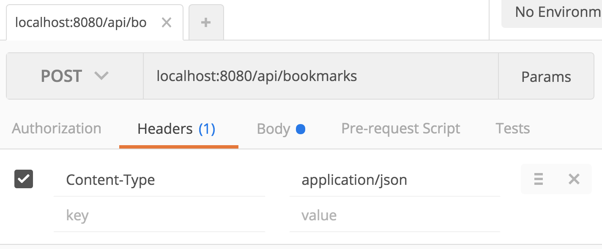
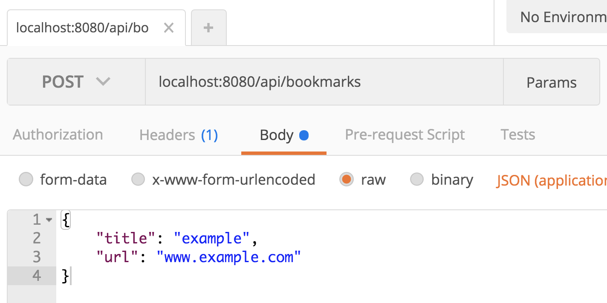

# JSON APIs in Express & Postman

## Lesson Objectives

  - Define microservice architecture
  - Build a RESTful HTTP API in Express that serves JSON data from a Mongo DB
  - Use Postman to test our RESTful routes
  - Use CORS with our Express API to permit requests from other domains
  - Use JS to consume an Express API

## Framing 
> (10 min, 0:10)

We've learned about using the handlebars templating engine to handle our views. This is a kind of single-server configuration, where the the server is handling models, views, and controllers.

---

What does each element in MVC do?

<details>
  <summary>
    Model
  </summary>
		Models encapsulate information from the database and give us an interface to query the database and change data.
</details>

<details>
	<summary>
		Views
	</summary>
      Views are the user-interface: they take data and render it to the page.
</details>

<details>
	<summary>
		Controllers
	</summary>
      Controllers define how routes are handled, and what response the server provides. Controllers also contain <a href="https://en.wikipedia.org/wiki/Business_logic">'business logic'</a> for our applications.
</details>

---

This project is an alternative to the traditional MVC architecture. In the context of this lesson, we'll be talking about how to separate our views from the server. Instead of directly rendering a view, the server will serve *data in the form of JSON* that a client-side JS application will 'consume' and generate content from.

> This an increasingly common pattern in modern web development, especially with the rise of 'serverless' services. You may or may not be familiar with the terms Platform as a Service and Service as a Service, but these are examples of 'serverless' services. See the additional reading [here](http://insightaas.com/serverless-computing-no-servers-really/).

We're not going to build a super complex application with many sets of endpoints today, but rather build a single service that implements a RESTful API over HTTP. We'll also have a basic pre-built front-end that we'll add AJAX functionality to, so that it can communicate with our REST API.

## Building an API in Express
> (5 min, 0:15)

For the remainder of class, we'll be building an application called 'book-e' which can save bookmarks for us. We'll clone down the back-end for `book-e` and examine the codebase, which just includes a model to start with. Then, we'll add a controller that serves JSON and then test the backend using a tool called [Postman, which can be downloaded here](https://app.getpostman.com/app/download/osx64).

After we've tested our API, we'll clone down a separate repository that handles the front end.

Go ahead and download postman now if you don't have it already. You'll need to create an account (free!) to use it.

## Book-e

### Set Up Book-e Backend
> (5 min, 0:20)

Clone down the [book-e-backend](https://git.generalassemb.ly/dc-wdi-node-express/book-e-backend) and **FOLLOW THE SET-UP INSTRUCTIONS**.

### Codebase Review (10 min, 0:30)

Pick a partner! Get up and move your seats! Don't just pick someone next to you. 

Then, spend the next 5 minutes looking over the codebase together. There are lots of comments explaining stuff.

Afterwards, we'll discuss each part of the starting codebase, using the commented annotations as our guide.

### Walkthrough (45 min / 1:15)

First, we'll npm install everything. Run it again even if you already ran it. Who cares. It's fine.

```sh
 $ npm install
```

### Add Test Route

Let's define a route and test that it works.

> In `controllers/bookmarks.js`...

```js
router.get('/', (req, res) => {
  res.send('<h1>Sup Multiverse?</h1>')
})
```

As expected, when you go to `http://localhost:8080/apis/bookmarks`, you see an `h1` element that contains 'Sup Multiverse?'.

Now, let' try an express response method that we haven't seen yet:  `.json()`

```js
router.get('/', (req, res) => {
  res.json({hello: 'multiverse'})
})
```

<details>
  <summary>What do you see in the browser?</summary>
  The browser renders a JSON object - the contents of which are the object we just defined.
</details>

This is the basis for how we will send data from the database to the front end.

### Reading Data

> The R in CRUD

Our controller is really intended to serve data from database, which means we need to query the database. To this end, we will use the model which defined using mongoose.

Next, let's fill out the routes for **reading** from the database.

```js
router.get('/', (req, res) => {
  Bookmark
    .find({})
    .then(bookmarks => res.json(bookmarks))
})
```

### You do: Get bookmark by title (10 min)

Using the same bookmark model, add some code to a route that retrieves a bookmark by its title.

Now let's test these routes in the browser!

>Note: In URLs, spaces are represented with `%20`.

### Creating Data

> The C in CRUD

We'll use an npm package called `body-parser` to be able to interpret the request body.

Let's require it in `index.js`...


```diff
const express             = require('express')
+const parser              = require('body-parser')

const app = express()

const bookmarksController = require('./controllers/bookmarks')

// Middleware configuration
+app.use(parser.urlencoded({extended: true})) // interprets key value pairs in URLs
+app.use(parser.json()) // interprets a stringified JSON object on the request body

app.use('/api/bookmarks/', bookmarksController)

app.listen(8080, () => console.log(`They see me rollin...on port 8080...`))
```

Now let's add functionality to make it work.

In `controllers/bookmarks.js`:

```js
router.post('/', (req, res) => {
  Bookmark
    .create(req.body)
    .then(bookmarks => res.json(bookmarks))
})
```

### Testing with Postman

1. Launch Postman.
2. Enter the URL into the bar at the top of the screen.
3. Click on headers and add the following...
  > 
4. Then, click on the body tab, select the raw radio button, and enter something like this...
  > 
5. Hit send! Scroll down and you'll the response in the panel below.

> What is the response?

### You do: Updating & Deleting Data (15 min)

> The U and D in CRUD

Using some of routes we haven't touched yet, use your models and the functions attached to them to:

* update a record in place (without adding a new one)
* delete a record

What HTTP verbs should you use for each? What routes should they go on?

Test your code using Postman. Make sure you set the appropriate verbs when you make the request.

> 5 min review


### Integration with a frontend

Next, we'll add the `cors` dependency. CORS stands for cross origin resource sharing.
Express is enforcing a CORS policy that prevents resource sharing without proper configuration on the back end.

You can think of origins as website domains, like `localhost:3000`, `localhost:8080`, `google.com`, `fuzzy-panda-cat.herokuapp.com`, and so on. 

The npm package `cors` is middleware that tells express to accept requests from different origins.

> [Here's a good article](https://developer.mozilla.org/en-US/docs/Web/HTTP/CORS) on MDN about what CORS is.

```diff
const express             = require('express')
const bookmarksController = require('./controllers/bookmarks')
const parser              = require('body-parser')
+const cors               = require('cors')

const app = express()

+app.use(cors())

app.use(parser.urlencoded({extended: true}))
app.use(parser.json())

app.use('/api/bookmarks/', bookmarksController)

app.listen(8080, () => console.log('They see me rollin...on port 8080...'))
```

### Break (10 min / 1:25)

### Book-E Frontend (40 min / 2:05)

Clone down [this repository](https://git.generalassemb.ly/dc-wdi-node-express/book-e-front/) and follow the set up instructions there. We'll be connecting this with our express back-end.

## Closing Review (25 min / 2:30)

Walk through the book-e-frontend solution.
